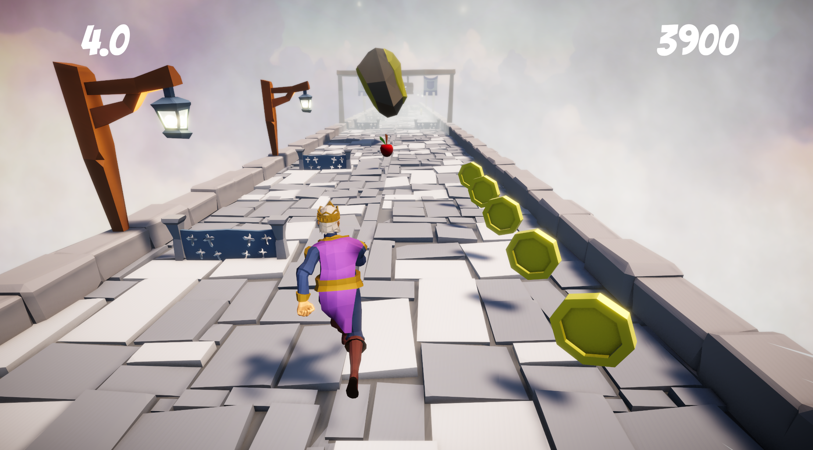

#🏃 Temple Run 스타일 3D 러너 게임

> Temple Run 스타일의 무한 러너 게임

---

## **📌 프로젝트 개요**

이 프로젝트는 **Temple Run 스타일의 3D 무한 러너 게임**으로, 플레이어가 자동으로 달립니다. **좌우 이동, 점프, 슬라이딩을 통해 장애물을 피하고** 코인을 획득하여 점수를 올리는 방식으로 진행됩니다.  
**사과를 획득하면 이동 속도가 증가**하며 나뉘도가 점점으로 상승하고, **체크포인트를 통과하면 제한 시간이 연장**됩니다.

본 프로젝트는 **Unity 6와와 C#을 활용하여 개발**되어,  
**Chunk 기반의 무작위 레벨 생성 시스템, Rigidbody 기반의 이동 및 충돌 처리, Object Pooling을 통한 최적화, Cinemachine을 활용한 카메라 연출** 등을 구현했습니다.

---

## **🛠 기술 스택**

### **🎮 사용 엔진 및 언어**

- **Unity 6 (2023 LTS)**
- **C#**

### **🔧 주요 구현 기술**

- **Rigidbody 기반 무리 이동 시스템** (좌우 이동, 점프, 슬라이딩)
- **Chunk 기반 무작위 스테이지 생성 시스템**
- **Object Pooling을 통한 최적화**
- **Cinemachine을 활용한 카메라 연출**
- **TextMeshPro를 활용한 UI 시스템 (점수, 타이머, 게임 오버 화면)**

---

## **🎮 게임 플레이**

### **🔹 조작 방법**

| 조작 키 | 동작      |
| ------- | --------- |
| ←, →    | 좌우 이동 |
| ↑, ↓    | 상하 이동 |

### **🔹 게임 진행 방식**

1. **자동으로 달리며 장애물을 피고, 코인을 수집해야 합니다.**
2. **사과를 먹으면 이동 속도가 증가합니다.**
3. **체크포인트를 통과하면 시간이 연장됩니다.**
4. **장애물과 충돌하면 속도가 감소하거나, 애니멀이연 후회됩니다.**
5. **남은 시간이 0이 되면 게임이 종료됩니다.**

---

## **🔗 링크**

📌 **GitHub Repository**: [링크](https://github.com/ralskwo/TempleRunProject)  
📌 **플레이 영상**: 
